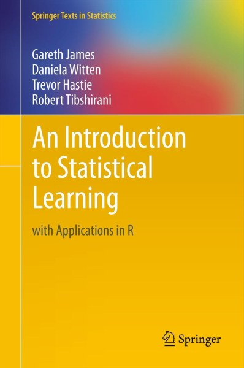
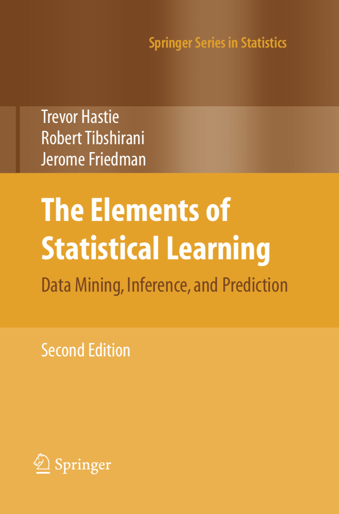

| Book | File    |
| :------------- | :------------- |
|       | [ISLR](../Refs/ISLR.pdf)       |
|       | [ESL](Refs/ISLR.pdf)       |

**Chapter 1: Introduction (slides)**
- [ ] Opening Remarks and Examples (18:18)
- [ ] Supervised and Unsupervised Learning (12:12)

**Chapter 2: Statistical Learning (slides)**
- [ ] Statistical Learning and Regression (11:41)
- [ ] Curse of Dimensionality and Parametric Models (11:40)
- [ ] Assessing Model Accuracy and Bias-Variance Trade-off (10:04)
- [ ] Classification Problems and K-Nearest Neighbors (15:37)
- [ ] Lab: Introduction to R (14:12)

**Chapter 3: Linear Regression (slides)**
- [ ] Simple Linear Regression and Confidence Intervals (13:01)
- [ ] Hypothesis Testing (8:24)
- [ ] Multiple Linear Regression and Interpreting Regression Coefficients (15:38)
- [ ] Model Selection and Qualitative Predictors (14:51)
- [ ] Interactions and Nonlinearity (14:16)
- [ ] Lab: Linear Regression (22:10)

**Chapter 4: Classification (slides)**
- [ ] Introduction to Classification (10:25)
- [ ] Logistic Regression and Maximum Likelihood (9:07)
- [ ] Multivariate Logistic Regression and Confounding (9:53)
- [ ] Case-Control Sampling and Multiclass Logistic Regression (7:28)
- [ ] Linear Discriminant Analysis and Bayes Theorem (7:12)
- [ ] Univariate Linear Discriminant Analysis (7:37)
- [ ] Multivariate Linear Discriminant Analysis and ROC Curves (17:42)
- [ ] Quadratic Discriminant Analysis and Naive Bayes (10:07)
- [ ] Lab: Logistic Regression (10:14)
- [ ] Lab: Linear Discriminant Analysis (8:22)
- [ ] Lab: K-Nearest Neighbors (5:01)

**Chapter 5: Resampling Methods (slides)**
- [ ] Estimating Prediction Error and Validation Set Approach (14:01)
- [ ] K-fold Cross-Validation (13:33)
- [ ] Cross-Validation: The Right and Wrong Ways (10:07)
- [ ] The Bootstrap (11:29)
- [ ] More on the Bootstrap (14:35)
- [ ] Lab: Cross-Validation (11:21)
- [ ] Lab: The Bootstrap (7:40)

**Chapter 6: Linear Model Selection and Regularization (slides)**
- [ ] Linear Model Selection and Best Subset Selection (13:44)
- [ ] Forward Stepwise Selection (12:26)
- [ ] Backward Stepwise Selection (5:26)
- [ ] Estimating Test Error Using Mallow’s Cp, AIC, BIC, Adjusted R-squared (14:06)
- [ ] Estimating Test Error Using Cross-Validation (8:43)
- [ ] Shrinkage Methods and Ridge Regression (12:37)
- [ ] The Lasso (15:21)
- [ ] Tuning Parameter Selection for Ridge Regression and Lasso (5:27)
- [ ] Dimension Reduction (4:45)
- [ ] Principal Components Regression and Partial Least Squares (15:48)
- [ ] Lab: Best Subset Selection (10:36)
- [ ] Lab: Forward Stepwise Selection and Model Selection Using Validation Set (10:32)
- [ ] Lab: Model Selection Using Cross-Validation (5:32)
- [ ] Lab: Ridge Regression and Lasso (16:34)

**Chapter 7: Moving Beyond Linearity (slides)**
- [ ] Polynomial Regression and Step Functions (14:59)
- [ ] Piecewise Polynomials and Splines (13:13)
- [ ] Smoothing Splines (10:10)
- [ ] Local Regression and Generalized Additive Models (10:45)
- [ ] Lab: Polynomials (21:11)
- [ ] Lab: Splines and Generalized Additive Models (12:15)

**Chapter 8: Tree-Based Methods (slides)**
- [ ] Decision Trees (14:37)
- [ ] Pruning a Decision Tree (11:45)
- [ ] Classification Trees and Comparison with Linear Models (11:00)
- [ ] Bootstrap Aggregation (Bagging) and Random Forests (13:45)
- [ ] Boosting and Variable Importance (12:03)
- [ ] Lab: Decision Trees (10:13)
- [ ] Lab: Random Forests and Boosting (15:35)

**Chapter 9: Support Vector Machines (slides)**
- [ ] Maximal Margin Classifier (11:35)
- [ ] Support Vector Classifier (8:04)
- [ ] Kernels and Support Vector Machines (15:04)
- [ ] Example and Comparison with Logistic Regression (14:47)
- [ ] Lab: Support Vector Machine for Classification (10:13)
- [ ] Lab: Nonlinear Support Vector Machine (7:54)

**Chapter 10: Unsupervised Learning (slides)**
- [ ] Unsupervised Learning and Principal Components Analysis (12:37)
- [ ] Exploring Principal Components Analysis and Proportion of Variance Explained (17:39)
- [ ] K-means Clustering (17:17)
- [ ] Hierarchical Clustering (14:45)
- [ ] Breast Cancer Example of Hierarchical Clustering (9:24)
- [ ] Lab: Principal Components Analysis (6:28)
- [ ] Lab: K-means Clustering (6:31)
- [ ] Lab: Hierarchical Clustering (6:33)

**Interviews**
- [ ] Interview with John Chambers (10:20)
- [ ] Interview with Bradley Efron (12:08)
- [ ] Interview with Jerome Friedman (10:29)
- [ ] Interviews with statistics graduate students (7:44)

- **Notes**

In January 2014, Stanford University professors Trevor Hastie and Rob Tibshirani (authors of the legendary Elements of Statistical Learning textbook) taught an online course based on their newest textbook, An Introduction to Statistical Learning with Applications in R (ISLR). I found it to be an excellent course in statistical learning (also known as “machine learning”), largely due to the high quality of both the textbook and the video lectures. And as an R user, it was extremely helpful that they included R code to demonstrate most of the techniques described in the book.

If you are new to machine learning (and even if you are not an R user), I highly recommend reading ISLR from cover-to-cover to gain both a theoretical and practical understanding of many important methods for regression and classification. It is available as a [free PDF](http://www-bcf.usc.edu/~gareth/ISL/) download from the authors’ website.

If you decide to attempt the exercises at the end of each chapter, there is a [GitHub repository of solutions](https://github.com/asadoughi/stat-learning) provided by students you can use to check your work.

As a supplement to the textbook, you may also want to watch the excellent course lecture videos (linked below), in which Dr. Hastie and Dr. Tibshirani discuss much of the material. In case you want to browse the lecture content, I’ve also linked to the PDF slides used in the videos.

Notes' source is https://www.r-bloggers.com/in-depth-introduction-to-machine-learning-in-15-hours-of-expert-videos/
